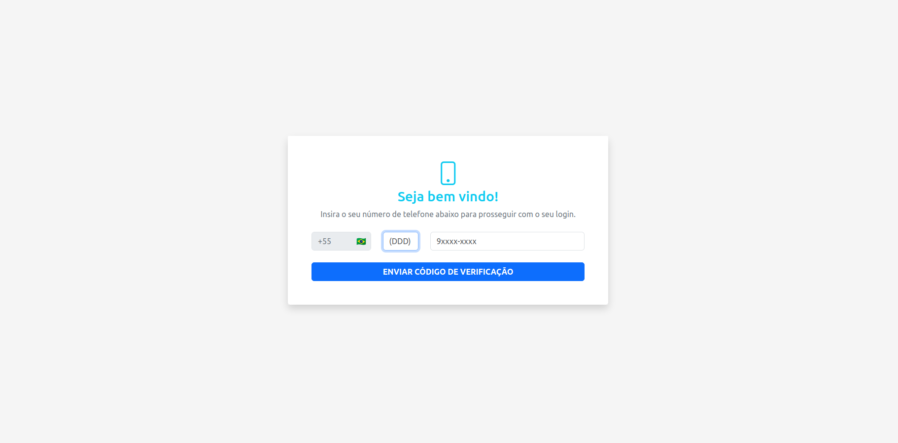

<h1 align="center"> Proof Of Concept 2 - Nuxt SMS Auth + JWT </h1>

<p align="center">
  Projeto prático de autenticação de usuário com utilzação do Nuxt 3, SMS Pin e Pinia.
</p>

<br>

<p align="center">
  
</p>

## 🚀 Tecnologias

Esse projeto foi desenvolvido com as seguintes tecnologias:

- [Nuxt.js](https://nuxtjs.org/)
- [Pinia](https://pinia.vuejs.org/)
- [TypeScript](https://www.typescriptlang.org/)
- Fetch API

## 💻 Projeto

Simulação de autenticação de usuário com API via Ruby on Rails (JWT), utilizando o Pinia Storage para armazenar o estado do usuário e outras informações, bem como SMS Pin Code para gerenciar o login, logout e sessions.

<h1 align="center"> Setup Front-end & Back-end</h1>

## 🔥 Front-end

Instale as dependências do projeto:

```
npm install
```

Rode a aplicação:

```
npm run dev
```

ou

```
npm run build
```

## 🔥 Back-end

Clonar o repositório https://github.com/LuanTedesco/razonet-poc-jwt e instalar as gems.

```
bundle install
```

Criar o banco e rodar as migrations

```
rails db:create
rails db:migrate
```

Rodar o servidor

```
rails s -b 0.0.0.0
```

Obs: o front rodará por padrão na porta 3001, enquanto o back rodará na 3000
<br /><br /><br />

<h4 align="center">
 
  <br />
  Feito com ♥ no Ubuntu 22.04 LTS
</h1>
